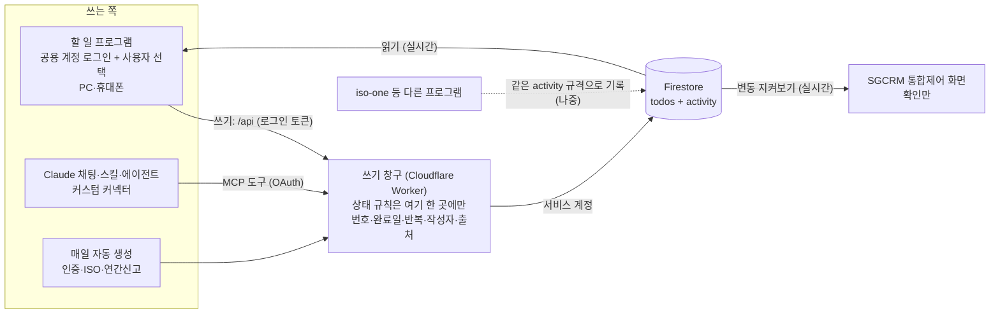

# TODO_ARCHITECTURE — 독립 할 일 프로그램 설계 (초안)

> 작성 2026-10-07 · 정석진 대표 요청 · **초안 — 코드 작업 없음, 결정 대기**
> 관련: `TODO_DESIGN.md`(10/6 A~D 구현분), `WORK_STRUCTURE.md` §8(10/7 결정), `SECURITY_PLAN.md`(잠금 계획),
> `SPLIT_PLAN.md`(CRM 뷰어화), `COMPANY_MASTER.md`(기업 키 = 사업자번호), `SG_CRM_Drive.gs`(v5.4)

---

## 목적 (사장님 정리, 2026-10-07)

1. **할 일 프로그램** — 정석진·김학미 두 대표가 각자 접속해서 「우리의 할 일」을 함께 보고 체크해 가며 놓치는 일 없이 일한다.
   ⚠️ **두 대표는 같은 계정(sgceo 구글·Claude)을 함께 쓴다.** → 로그인은 「SG솔루션 사람인가」만 확인하고, **「누가 했나」는 계정이 아니라 기기·대화에서 고른 이름으로** 남긴다(§4-0).
2. **SGCRM 메인 = 통합제어 화면** — 직접 입력은 없고, 각 업무 프로그램(할 일·iso-one·인증 …)을 바라보며 **무엇이 바뀌었는지 실시간으로 확인만** 한다.
3. **Claude 스킬·에이전트** — 업무를 하는 동안 우리가 하는 일을 계속 지켜보고 처리한다(할 일 추가·완료·누락 발견). 사람과 **같은 쓰기 창구**를 쓴다.

**역할 분담 (사장님 확인, 2026-10-07)**

| 화면·창 | 하는 일 | 쓰기 |
|---|---|---|
| **Claude 창** | 업무를 하면서 할 일을 **추가·수정·삭제·완료** — **주 입력 경로** | ✅ (MCP → 쓰기 창구) |
| **할 일 웹 화면** | 두 대표가 각자 접속해 **확인**하고 체크(완료·미루기 정도) | ✅ 가볍게 (같은 창구) |
| **SGCRM 통합제어 화면** | 업무가 자동으로 갱신되는 것을 **보기만** — 최신 상태를 두 대표가 확인 | ❌ 없음 |

→ 할 일 프로그램과 에이전트는 **쓰고**, SGCRM은 **변동을 지켜본다.** 이를 위해 모든 쓰기가 **변동 기록(`activity`)** 을 남긴다(§3-1).
TV 모드는 이번 설계 범위에서 뺀다(기존 `#tv` 코드는 그대로 두되 따로 손대지 않음).

---

## 0. 한 장 요약



- **저장소는 `todos` 하나**(새 DB 없음) + 모든 프로그램이 같이 쓰는 변동 기록 `activity`. 화면(할 일 프로그램·CRM)은 **읽기만** 직접 하고, **쓰기는 모두 쓰기 창구를 거친다.**
- 보안규칙에서 `todos` 쓰기를 화면에 막아 두면, 쓰기 창구를 우회하는 길이 아예 없어진다 → 상태 규칙이 한 곳에만 있게 된다.
- 쓰기 창구 권장: **Cloudflare Workers**(무료, 원격 MCP를 제대로 올릴 수 있음). §5 비교.
- 순서: **로그인·보안규칙 → 쓰기 창구 → 할 일 웹 → CRM 뷰어화 → MCP 커넥터 → 드라이브 스크립트 「할일」 이동 폐기**. §7.

---

## 1. 지금 구조 (2026-10-07, 코드 기준)

### 1-1. `todos` 필드

| 필드 | 뜻 | 쓰는 곳 |
|---|---|---|
| `text` | 할 일 글 (자동 생성분은 `[기업명] …` 앞머리) | 전부 |
| `status` | `wait` 대기 / `ing` 진행 / `done` 완료 — **3개뿐** | 전부 |
| `dueDate` | 마감 `YYYY-MM-DD` (없을 수 있음) | 전부 |
| `bizno` / `companyName` | 연결 기업(사업자번호·`TEMP-…`) / 이름 사본 | 연결된 것만 |
| `category` | 업무 분야(대분류 key, `confirm`·`fin` 포함) | 선택 |
| `source` | `manual` `voice` `chat` `cert` `iso` `annual` `lead` `card` `secretary` | 없으면 `todoSource()`가 추정 |
| `sourceRef` | 출처 ID (중복 생성 방지용) | 자동·음성·카드 |
| `certTaskId` / `isoAuditId` | 옛 중복 방지 키 (지금도 이것으로 중복 판정) | 인증·ISO 자동 |
| `priority` | `high` / 빈 값 | 선택 |
| `tag` | 자유 태그 (옛 「인증」「ISO」「긴급」「미팅」) | 선택 |
| `memo` | 메모 | 선택 |
| `createdBy` | 적은 사람 — **기기 localStorage(`sgcrm_me`)에서 가져옴**, 음성은 `음성`, 채팅은 설명 글에서 뽑은 이름 | 빈 값 많음 |
| `createdAt` `updatedAt` `statusAt` `doneAt` | 밀리초 시각. `statusAt` = 상태·마감·메모를 바꾼 때(멈춤 판정 기준) | |

- **번호 없음.** 문서 ID는 Firestore 무작위 ID 또는 `voice_<MD5>`.
- `app_state/config.todoRules` = 기준 숫자 `{stallDays:14, soonDays:3, horizonDays:30, leadDays:14}`.

### 1-2. 화면 네 칸 (저장값이 아니라 계산 — `todoBucket()` L4697)

| 순서 | 칸 | 규칙 |
|---|---|---|
| 1 | 놓치고 있는 일 `miss` | ① 마감 지남 ② `ing`인데 `statusAt` 후 14일 ③ `wait`인데 마감 3일 이내 ④ 잠재고객 가상 카드(`todoLeadItems`) |
| 2 | 지금 하는 일 `ing` | `status=ing` |
| 3 | 해야 할 일 `todo` | `wait` + 마감 없음 또는 30일 이내 |
| 4 | 앞으로 할 일 `later` | `wait` + 마감 30일 넘음 |

10/6 개편 후 할 일 페이지는 [오늘|기업별|주간] 보기, 네 칸 보드는 대시보드 요약에만 남음. `#tv` TV 모드 있음.

### 1-3. 쓰는 곳 — **10곳 이상으로 흩어져 있음**

| 쓰는 곳 | 함수 | 하는 일 |
|---|---|---|
| CRM 빠른 입력 | `todoQuickSave` | 추가 (`source:manual`, 기업·날짜 자동 인식) |
| CRM 할 일 창 | `saveTodo` | 추가·수정 (`doneAt`·`statusAt` 계산) |
| CRM 버튼 | `todoSetStatus` `todoPostpone` `todoDropDay` `cycleTodo` | 상태·마감 변경 |
| CRM 삭제 | `deleteTodoItem` | **완전 삭제** |
| CRM 기업 연결 | `todoLinkSuggest` | `bizno` 채우기 |
| CRM 잠재고객·업체카드 | `todoFromLead` `todoCardApply` | 추가 (`lead`·`card`) |
| CRM 화면 열 때 자동 | `createCertTasks` `createIsoTasks` `createAnnualTasks` (`loadAll` L2669~) | 인증 갱신 D-90·ISO 차기심사·연간신고 할 일 추가 |
| CRM 사업자번호 변경 | `moveBiznoData` (L9379) | 할 일 `bizno` 옮김 |
| CRM 백업 복원 | 복원 기능 | `todos` 덮어쓰기 |
| 드라이브 스크립트 v5.4 | `moveVoiceTodos` → `writeTodo` | 캘린더 「할일」 일정·구글 Tasks → `todos` 추가(REST + 공개 API 키), 원본 삭제 |
| 채팅(sg-todo 스킬) | — | 직접 못 씀. **캘린더에 「할일」 일정을 만들면 위 스크립트가 10분 안에 옮김**(추가만 가능) |

그리고 마감 있는 할 일은 저장할 때마다 `gcalSyncTodo`가 구글 캘린더에 `[ToDo]` 일정으로 보낸다(`voice`·`chat`은 제외).

### 1-4. 「반복·자동 생성」의 실제

- **일반 반복(매주·매월)은 없다.** `TODO_DESIGN.md` §9에서 범위 밖으로 뺐다.
- 규칙 자동 생성 3종(인증 D-90 · ISO 차기심사 · 연간신고 3/1~기한)이 **CRM 페이지를 열 때마다, 연 기기마다** 돈다.
  중복 방지는 화면이 메모리에 들고 있는 `todos` 배열을 보고 판단 → PC·노트북·폰·TV가 동시에 열면 **같은 할 일이 두 번 생길 수 있다**(무작위 문서 ID라 Firestore가 막아 주지 않음).

### 1-5. 드라이브 스크립트 v5가 쓰는 필드

`text` `status:'wait'` `dueDate` `source:'voice'|'chat'` `sourceRef:'task:<id>'|<일정ID>` `memo` `createdBy:'음성'|<이름>` `createdAt` `updatedAt` (+ 기업을 찾으면 `bizno` `companyName`)
문서 ID `voice_<MD5(sourceRef)>` → 같은 일정은 409로 한 번만. 채팅 할 일은 설명에 「Claude 채팅에서 등록 (작성: 이름)」 문구로 구분.

---

## 2. 새 방향과 비교 — 바꿔야 할 점

| # | 지금 | 바꿀 점 |
|---|---|---|
| 1 | 쓰는 곳 10곳 이상, 규칙이 곳마다 다름 | **쓰기 창구 한 곳**으로. 화면은 읽기만. 보안규칙으로 `todos` 직접 쓰기 차단 |
| 2 | 규칙 불일치 — 다시 열어도 `doneAt`이 남음 / 빠른 입력·카드 추가는 `statusAt` 없음 / 수정 창은 마감만 바꿔도 `statusAt` 갱신 등 | 상태 변경 함수 **하나**(§3-4)가 `doneAt`·`statusAt`·`updatedAt`·기록을 계산 |
| 3 | 작성자 = 기기에 고른 이름(비우면 빈 값), 채팅은 글 속 이름 | 공용 계정이라 계정으로는 구분 불가 → **기기마다 사용자를 한 번 고르게 하고, 안 고르면 쓰기 전에 묻는다**(빈 값 금지). 창구가 `by`에 함께 기록(§4-0) |
| 4 | 번호 없음 — 채팅에서 「그거 완료」를 정확히 집을 수 없음 | **`T-0123` 번호** 부여(§3-2) |
| 5 | 상태 3개 | 10/7 결정대로 **「기다리는 중」 추가**, 종류(전화·서류·신청·방문·독촉·내부) 추가 |
| 6 | 반복 없음 | 「반복」 필드 + 완료 시 다음 회차를 **쓰기 창구가** 만듦(§3-5) |
| 7 | 자동 생성이 화면 열 때·기기마다 실행 → 중복 위험 | **하루 한 번 서버 예약 작업**(Worker cron) + 중복 키 트랜잭션 |
| 8 | 칸 계산(`todoBucket`)이 CRM 안에만 있음 | **공용 모듈 `todo-core.js`** — 웹·CRM 뷰어·MCP 조회가 같은 계산 |
| 9 | 완전 삭제 | 채팅에선 삭제 없음. 웹에서도 **`cancel`(취소) 상태**로 남기고, 진짜 삭제는 관리 기능으로만 |
| 10 | 마감 있는 할 일 전부 캘린더 `[ToDo]` 전송 | 10/7 결정(캘린더 = 약속만)에 맞춰 **전송 중단**, 기존 `[ToDo]` 일정 정리(목록 확인 후) |
| 11 | 로그인·규칙 없음, 드라이브 스크립트가 공개 API 키로 씀 | **가장 먼저** 로그인 + 규칙(§4). 스크립트는 OAuth(SECURITY_PLAN 2-3) 또는 창구 경유 |
| 12 | 채팅 → 캘린더 → 스크립트 → `todos` (추가만, 10분 지연) | 채팅 → **MCP → 창구** (추가·완료·수정·조회, 즉시). 캘린더 「할일」 경로 폐기 |
| 13 | CRM `moveBiznoData`·백업 복원이 `todos`를 직접 고침 | 잠근 뒤엔 실패 → 창구의 관리 엔드포인트로 옮김 |

### 기존 결정끼리 어긋나는 것 (→ §9 결정 목록)

| 항목 | `TODO_DESIGN.md` (10/6) | `WORK_STRUCTURE.md` §8 (10/7) |
|---|---|---|
| 담당자 | 두지 않음(공동) | **선택** 항목, 비우면 「공통」 |
| 업체 | 없어도 입력 | **필수**(사업자번호) |
| 기한 | 없어도 입력 | **필수**, 안 넣으면 다음 영업일 |
| 「보류」 류 상태 | 두지 않음 | **「기다리는 중」 추가** |
| 캘린더 | 마감 있는 할 일 전송 | 약속만, 할 일 전체 동기화 안 함 |

---

## 3. 데이터 모델 (`todos` 확장 — 기존 문서는 그대로 읽힘)

### 3-1. 필드

| 필드 | 형식 | 필수 | 누가 정하나 | 비고 |
|---|---|---|---|---|
| `no` | 정수 | ✅ | **창구** | 🆕 번호. 화면 표시 `T-0123` |
| `text` | 문자 | ✅ | 사람 | `[기업명]` 앞머리는 새로 붙이지 않음(기업 칸이 따로 있음) |
| `status` | `wait` `ing` `waiting` `done` `cancel` | ✅ | 사람 → 창구 검증 | 🆕 `waiting`(기다리는 중) `cancel`(취소) |
| `waitingFor` | 문자 | | 사람 | 🆕 무엇을 기다리나 ("서류 회신", "심사원 일정") |
| `dueDate` | `YYYY-MM-DD` | 결정 D3 | 사람 | `waiting`이면 「다시 확인할 날」로 씀 |
| `bizno` | 문자 | 결정 D2 | 창구가 이름→번호 해석 | `companies` 문서 ID(사업자번호, `TEMP-…`) — iso-one과 같은 키 |
| `companyName` | 문자 | | 창구 | 이름 사본. 매일 예약 작업이 기업명 변경을 따라 고침 |
| `category` | 대분류 key | | 사람 | 기존 그대로 |
| `kind` | `call` `doc` `apply` `visit` `chase` `internal` | | 사람 | 🆕 전화·서류·신청·방문·독촉·내부 |
| `priority` | `high` / 빈 값 | | 사람 | 기존 |
| `assignee` | 이름 / 빈 값=공통 | 결정 D1 | 사람 | 🆕 (결정에 따라 안 둘 수도) |
| `memo` | 문자 | | 사람 | 기존. 채팅은 「메모 덧붙이기」 가능 |
| `tag` | 문자 | | 사람 | 기존 유지(새 화면에선 감춤) |
| `source` | §3-3 | ✅ | **창구** | 생긴 곳 |
| `sourceRef` | 문자 | | 창구 | 출처 ID |
| `dedupeKey` | 문자 | | **창구** | 🆕 `source:sourceRef` — 자동 생성 중복 방지(트랜잭션에서 검사) |
| `repeat` | `{every:'week'\|'month'\|'year', n, day}` | | 사람 | 🆕 §3-5 |
| `seriesId` | 문자 | | 창구 | 🆕 반복 묶음 ID (첫 회 번호) |
| `createdBy` `updatedBy` | 이름 | ✅ | **창구** (화면·채팅이 보낸 사용자 이름 검증) | `정석진` `김학미` `공동` `자동` `음성`. 채팅·에이전트는 `Claude(정석진)` |
| `createdAt` `updatedAt` `statusAt` `doneAt` | 밀리초 | | **창구** | 계산 규칙 §3-4 |
| `deletedAt` `deletedBy` `deleteReason` | 밀리초·이름·문자 | | **창구** | 🆕 휴지통(삭제 후 30일 보관). 값이 있으면 모든 목록·칸 계산에서 제외 |
| `certTaskId` `isoAuditId` | 문자 | | — | 옛 키. 읽기만 하고 새로 쓰지 않음(`dedupeKey`로 대체) |

**변동 기록 `activity`** — 통합제어 화면과 에이전트가 「무엇이 바뀌었나」를 보는 곳 (최상위 컬렉션, 같은 Firestore)

| 필드 | 뜻 | 예 |
|---|---|---|
| `at` | 밀리초 시각 | |
| `app` | 어느 프로그램 | `todo` (나중에 `iso` `cert` `mainbiz` …) |
| `ref` | 대상 | `T-0123` |
| `action` | `create` `status` `due` `edit` `complete` `cancel` `auto` | |
| `summary` | 사람이 읽는 한 줄 | `김학미 · T-0123 하이퍼다인 벤처 서류 요청 → 완료` |
| `by` | 누가 | `정석진` `김학미` `Claude(정석진)` `자동` |
| `via` | 어느 창구로 | `web` `mcp` `cron` `script` `migration` (출처 `source`와 별개) |
| `bizno` | 관련 기업 | 기업별로 모아 보기 |
| `changes` | 바뀐 값 `{status:['ing','done']}` | |

- 쓰기 창구가 **할 일을 저장하는 같은 트랜잭션에서** 남긴다 → 기록 없는 변경은 생기지 않는다.
- SGCRM 통합제어 화면은 `activity`를 최근 순으로 실시간 구독해 「방금 바뀐 것」 띠를 보여 준다(§7 단계 5).
- 에이전트는 「지난번 본 뒤로 바뀐 것」을 `activity`로 받아 이어서 처리한다(MCP `todo_changes`, §6).
- 다른 프로그램(iso-one 등)도 **같은 규격으로** 남기면 통합제어 화면이 프로그램마다 따로 코드를 갖지 않아도 된다(이번 범위는 할 일만).
- 화면·에이전트는 `activity`를 **읽기만**. 오래된 기록(예: 1년)은 정리 여부를 나중에 정한다.

### 3-2. 번호 체계

- 표시 `T-` + 4자리(`T-0001` … `T-9999`, 넘으면 `T-10000`). 저장은 정수 `no`.
- 다음 번호는 `app_state/todo_seq` 문서 `{last: 123}` 하나에서 **트랜잭션으로** 받는다(동시에 두 건 와도 겹치지 않음).
  `app_state/config`와는 다른 문서라 CRM의 `setDoc` 덮어쓰기와 무관.
- **번호는 재사용하지 않는다.** 취소·삭제돼도 빈 번호로 남는다.
- 새 문서 ID = 번호 그대로(`T-0124`) → 콘솔에서 찾기 쉬움. 옛 문서는 ID를 바꾸지 않고 `no`만 붙인다. **찾을 때는 항상 `no` 필드로.**
- 기존 문서 번호는 `createdAt` 오래된 순으로 1번부터(§8).

### 3-3. 출처(`source`) — 기존 값 유지 + 1개

| 값 | 뜻 | 만드는 곳(새 구조) |
|---|---|---|
| `manual` | 웹 화면 손 입력 | 웹 → 창구 |
| `chat` | Claude 채팅 | MCP → 창구 |
| `voice` | 음성(제미나이 → 구글 Tasks) | 드라이브 스크립트 → 창구 (유지 여부 결정 D9) |
| `cert` `iso` `annual` | 인증 갱신 D-90 · ISO 차기심사 · 연구소 연간신고 | 창구 예약 작업(매일) |
| `lead` | 잠재고객 후속 | 웹 「할 일로 만들기」 |
| `card` | 업체카드 「다음 할 일」 | 웹(카드 가져오기) |
| `secretary` | 비서 에이전트 | 창구(비서용 키) |
| `repeat` 🆕 | 반복 할 일의 다음 회차 | 창구(완료 시) |

### 3-4. 상태 규칙 — 창구 안의 함수 하나 `applyChange(old, patch, actor)`

| 경우 | 창구가 하는 일 |
|---|---|
| 새로 만들 때 | `no` 발급, `createdAt=updatedAt=statusAt=지금`, `createdBy=actor`, `source` 확정, 기업 이름→`bizno` 해석, 기록 `create` |
| `status` → `done` | `doneAt=지금`, `statusAt=지금`, 반복이면 다음 회차 생성(§3-5) |
| `done`/`cancel` → 다시 열기 | **`doneAt` 지움**(지금은 남아 있음) |
| `status`·`dueDate`·`memo`·`waitingFor` 변경 | `statusAt=지금` (멈춤 판정 기준 — 지금 CRM 규칙 그대로) |
| 기업·분야·종류·태그만 변경 | `updatedAt`만 (진행으로 안 봄) |
| 모든 쓰기 | `updatedAt=지금`, `updatedBy=actor`, 기록 남김 |
| 거절 | 없는 상태값, 날짜 형식 오류, 없는 기업번호, 빈 글 → 저장하지 않고 이유를 돌려줌 |
| 중복 방지 | 자동 생성은 `dedupeKey`, 채팅 추가는 「같은 글+기업+마감이 2분 안에 또」면 기존 번호를 돌려줌(재시도 대비) |

칸 계산(`bucket`)도 `waiting`을 넣어 고친다:
`waiting` + 확인일 지남 → **놓친 일**(「회신 기한 3일 지남」), `waiting` + 확인일 없음 + 14일 무변경 → 놓친 일, 그 외 → 새 칸 **「기다리는 중」**. `cancel`은 완료처럼 숨김.

### 3-5. 반복 할 일

- `repeat:{every:'week', n:1, day:1}` = 매주 월요일 / `{every:'month', n:1, day:25}` = 매월 25일 / `{every:'year', n:1, month:3, day:1}`.
- **완료하는 순간** 창구가 다음 회차를 만든다: 같은 글·기업·분야·반복, `dueDate`=다음 날짜, `source:'repeat'`, `seriesId` 유지, `dedupeKey=repeat:<seriesId>:<dueDate>`(두 번 완료 눌러도 한 건).
- 완료 안 하고 기한이 지나면 다음 회차는 생기지 않고 「놓친 일」로 남는다(쌓이지 않게).
- 반복 끊기 = `repeat` 비우기.

### 3-6. 업체 연결

- 키 = **사업자번호**(`companies` 문서 ID). iso-one `iso_audits.bizno`와 같다.
- 창구가 이름 → 번호를 해석한다(CRM `normCompName`·`compNameKeys`·`findCompany` 규칙을 `todo-core.js`로 옮겨 그대로 사용).
  - 하나 → 연결 / 여럿 → **저장하지 않고 후보를 돌려줌**(채팅이 되묻게) / 없음 → 기업 없이 저장(업체 필수로 정하면 거절).
- 사업자번호 변경(`TEMP-…` → 정식)은 창구 관리 기능 `rebizno`가 할 일 `bizno`를 옮긴다(CRM `moveBiznoData`가 호출).

---

## 4. 로그인과 보안규칙 — **모든 것보다 먼저**

### 4-0. 공용 계정 전제 — 「로그인」과 「누가 했나」를 나눈다

두 대표가 구글·Claude 계정을 **하나(sgceo)** 로 같이 쓴다. 그래서:

| 구분 | 무엇으로 | 목적 |
|---|---|---|
| **로그인** (들어올 수 있나) | sgceo 구글 로그인 / 커넥터 OAuth | 보안 — 외부인 차단. 허용 메일은 `sgceo@sgsolutionss.com` 하나로 시작 |
| **사용자** (누가 했나) | 할 일 프로그램: **기기별 「나는 누구」 선택**(처음 한 번, 화면 위에 이름 표시·바꾸기 버튼) / 채팅: 대화에서 정해진 이름 | 기록 — `createdBy` `updatedBy` `activity.by` |

- 사용자 선택은 **보안 장치가 아니라 기록용**이다. 두 대표가 서로 믿는 사이라 이걸로 충분하다고 본다.
- 이름이 비어 있으면 창구가 쓰기를 거절한다 → 「누가 했는지 모르는 기록」이 생기지 않는다. 고를 수 있는 값: `정석진` `김학미` `공동`.
- PC·노트북·휴대폰은 각자 주로 쓰는 사람이 정해져 있으므로 기기 단위로 기억하면 거의 다시 묻지 않는다. 같이 쓰는 기기는 화면 위 이름을 눌러 바꾼다.
- 채팅(같은 Claude 계정): 스킬이 **대화마다 처음 쓰기 전에 한 번** 「정석진/김학미 중 누구세요?」를 확인하고(대화에 이미 나와 있으면 생략), 그 이름을 `author`로 보낸다. 더 편하게 하려면 두 분이 **Claude 프로젝트를 하나씩**(「정석진 업무」「김학미 업무」) 만들어 프로젝트 지침에 「나는 ○○○」을 적어 두면 묻지 않아도 된다(결정 D7).
- 「담당」(D1)은 사용자와 별개 — 담당을 두면 「내 것 + 공동」 보기가 기기의 사용자 이름을 기준으로 걸러진다.
- 나중에 계정을 나누게 되면(김학미 대표 구글 계정 추가) 허용 메일에 넣기만 하면 되고, 그때는 계정 이름이 사용자 선택보다 우선한다.

### 4-1. 로그인 방식

| 누가 | 어디서 | 방식 |
|---|---|---|
| 두 대표 | 할 일 프로그램·CRM (PC·휴대폰) | **Firebase Authentication — Google 로그인**, **공용 sgceo 계정**. 기기마다 한 번 로그인하면 계속 유지. 누가 했는지는 §4-0 사용자 선택 |
| Claude 채팅 | claude.ai 커스텀 커넥터 | 공용 Claude 계정에 커넥터를 **한 번** 연결(sgceo 구글 로그인 OAuth) → 두 분 모두 같은 커넥터 사용 |
| 드라이브 스크립트 | Apps Script | sgceo OAuth 토큰(읽기) + 창구용 비밀 키(쓰기) |
| 예약 작업·창구 | Cloudflare | **서비스 계정**(최소 권한: Cloud Datastore 사용자). 규칙이 아니라 IAM으로 통과 |
| iso-one | iso-one.web.app | 같은 구글 로그인 (iso-one 쪽 작업 — 별도 코딩창) |

- 허용 도메인: `sggit-png.github.io`(CRM·할 일 웹), `iso-one.web.app`.
- 휴대폰: Google 로그인은 **팝업 방식**으로(리다이렉트 방식은 github.io ↔ firebaseapp.com 주소가 달라 iOS 사파리에서 실패할 수 있음). 할 일 웹은 「홈 화면에 추가」(PWA)로 앱처럼.
- Spark 요금제에서 Google 로그인은 무료.

### 4-2. 규칙 — 2단계로 건다

**1단계(로그인 도입 직후)**: `SECURITY_PLAN.md` 2-2와 같음 — 두 대표만 읽기·쓰기. 이때는 CRM이 아직 `todos`를 직접 쓴다.

**2단계(창구 가동 후)**: `todos` 직접 쓰기 차단.

```
rules_version = '2';
service cloud.firestore {
  match /databases/{database}/documents {
    function signedIn(){ return request.auth != null && request.auth.token.email_verified == true; }
    function staff(){ return signedIn() && request.auth.token.email in
                        ['sgceo@sgsolutionss.com']   // 계정을 나누면 여기에 추가; }

    // 최상위 컬렉션 — 읽기·쓰기는 두 대표만.
    // 단 todos·activity·번호 카운터는 아무도 직접 못 쓴다 → 쓰기 창구(서비스 계정)만.
    match /{col}/{id} {
      allow read:  if staff();
      allow write: if staff() && !(col in ['todos','activity'])
                              && !(col == 'app_state' && id == 'todo_seq');
    }
  }
}
```

> ⚠️ 규칙은 「하나라도 허용하면 허용」이다. `match /{document=**} { allow write: if staff(); }` 같은 전체 허용 줄이
> 하나라도 남아 있으면 `todos` 차단이 무력화된다. 위처럼 **한 줄에서 예외를 빼는 방식**으로 쓴다.

### 4-3. 잠그기 전에 같이 바꿀 것 (`SECURITY_PLAN.md` 2-4 + 할 일 관련)

| 대상 | 1단계 잠금 전 | 2단계 잠금 전 |
|---|---|---|
| CRM | 로그인 화면 | 할 일 쓰기 제거(뷰어화), `moveBiznoData`·백업 복원의 `todos` 부분을 창구 호출로 |
| 드라이브 스크립트 | v6: OAuth 토큰으로 읽기·쓰기 | v7: 「할일」 이동 폐기 또는 창구 경유(D9) |
| iso-one | 로그인 | 영향 없음(`todos` 안 씀) |
| 자동 생성 3종 | 그대로 | CRM `loadAll`에서 빼고 **창구 예약 작업**으로 |

---

## 5. 쓰기 창구 — 세 후보 비교

| | A. Apps Script 웹앱 | **B. Cloudflare Workers (권장)** | C. Blaze 전환 + Cloud Functions |
|---|---|---|---|
| 비용 | 무료 | 무료(하루 10만 요청, 요청당 CPU 10ms) — **카드 등록 없음, 과금 불가** | 무료 한도 안이면 ₩0이지만 **카드 등록 필수, 상한 없음**(예산 알림만). 함수 이미지 보관비 월 수백 원 생길 수 있음 |
| claude.ai 원격 MCP | ❌ **사실상 불가** — 요청 헤더(`Authorization`)를 못 읽고, 응답 상태코드·헤더를 못 정하고, 응답이 다른 주소로 302 리다이렉트됨. 커넥터 OAuth(401 응답·`/.well-known` 메타데이터)를 만들 수 없다 | ✅ Cloudflare가 원격 MCP + OAuth 라이브러리(`workers-oauth-provider`)를 제공. 구글 로그인을 앞단에 둘 수 있음 | ✅ 가능(Node MCP SDK). OAuth 부분은 직접 구성 |
| 웹 화면 쓰기 | 가능(토큰을 본문에 넣어야 함, 헤더 불가) | 가능 — Firebase 로그인 토큰을 헤더로 받아 검증 | 가능 — Callable 함수가 토큰 검증 자동 |
| Firestore 접근 | sgceo 계정 토큰(REST) | 서비스 계정 → REST (토큰 서명 코드 약 100줄, 직접) | **Admin SDK** 그대로, 같은 프로젝트 |
| 예약 작업(매일 자동 생성) | 시간 트리거 ✅ | Cron 트리거 ✅ | Scheduler(3개 무료) ✅ |
| 공용 코드(`todo-core.js`) 공유 | 어려움(Apps Script는 모듈 import 없음, 복사해야 함) | ✅ 웹과 같은 JS 모듈 그대로 import | ✅ 같은 JS |
| 응답 속도 | 느림(1~3초, 첫 호출 더) | 빠름(서울 근처 엣지) | 첫 호출 수 초(콜드 스타트) |
| 배포 | **편집기에 붙여넣고 「새 버전」 — 지금도 「배포본 ≠ 저장소」 사고가 반복** | `wrangler deploy` 또는 GitHub Actions 자동 배포 | `firebase deploy` (CLI·빌드 필요) |
| 새로 관리할 것 | 없음 | Cloudflare 계정 1개, 서비스 계정 키(비밀값) 보관 | 결제 계정, GCP 콘솔 |
| 한도 위험 | 하루 UrlFetch 2만 회, 동시 실행 30 | CPU 10ms 초과 시 유료($5/월) 필요 — 할 일 규모면 해당 없음 | 거의 없음 |

**권장: B. Cloudflare Workers.** 결정적 이유는 **원격 MCP 커넥터를 올릴 수 있으면서 무료 고정**이라는 점. 웹 API·MCP·예약 작업을 Worker 하나에 둔다.
Apps Script는 지금처럼 **드라이브·캘린더 일(업체카드 읽기, 사업자등록증 OCR, 일정 목록)** 만 맡긴다.
C는 「같은 프로젝트·Admin SDK·트리거」가 가장 깔끔하지만 카드 등록이 전제 — 나중에 다른 업무 프로그램도 서버가 필요해지면 그때 재검토.

### 5-1. Worker 구성 (B안)

| 경로 | 쓰는 이 | 인증 | 내용 |
|---|---|---|---|
| `POST /api/todos` | 웹 | Firebase ID 토큰 | 추가 |
| `PATCH /api/todos/:no` | 웹 | 〃 | 수정·상태 변경 |
| `POST /api/todos/:no/complete` | 웹 | 〃 | 완료(반복 처리) |
| `POST /api/admin/rebizno` | CRM | 〃 (staff) | 사업자번호 변경 반영 |
| `POST /api/ingest` | 드라이브 스크립트·비서 | 비밀 키(헤더) | 음성·비서 할 일 추가 |
| `/mcp` | claude.ai | OAuth(구글 로그인, 허용 메일) | MCP 도구 §6 |
| cron 매일 06:00 KST | — | — | 인증·ISO·연간신고 자동 생성, 기업명 사본 갱신 |

- 읽기는 웹이 Firestore를 **직접 실시간 구독**(규칙상 허용) → 화면은 지금처럼 즉시 바뀐다. 창구는 쓰기만.
- 서비스 계정 키는 Worker 비밀값(secret)에만. 저장소·화면 코드에 넣지 않는다.

---

## 6. MCP 도구 (claude.ai 커스텀 커넥터) — Claude 창이 주 입력 경로

| 도구 | 입력 | 하는 일 / 돌려주는 것 | 성격 |
|---|---|---|---|
| `todo_add` | `text` 필수, `author`* 필수, `company`(이름 또는 사업자번호), `due`(`2026-10-20`/`내일`/`10/20`), `status`, `kind`, `category`, `priority`, `memo`, `repeat` | 추가 → `T-0124 저장됨 · 하이퍼다인 · 10/20`. 기업 후보가 여럿이면 **저장 안 하고 후보 목록** | 쓰기 |
| `todo_complete` | `no`(하나 또는 여러 개), `note` | 완료. 반복이면 다음 회차 번호도 알려 줌 | 쓰기 |
| `todo_update` | `no` + 바꿀 것: `text` `status`(시작·기다림·다시 열기·취소) `due` `waitingFor` `company` `kind` `category` `priority` `memo` / `memoAppend` `repeat` | 수정 → 바뀐 항목 요약 | 쓰기 |
| `todo_list` | `view`: `today`(놓친 일·지금 하는 일·해야 할 일) / `missed` / `waiting` / `week` / `company` / `recent_done`, `company`, `category`, `query`, `limit` | 한 줄씩: `T-0123 [놓침·마감 3일 지남] 하이퍼다인 — 벤처 서류 요청 (10/04)` — **웹과 같은 칸 계산** | 읽기 |
| `todo_get` | `no` | 전체 필드 + 변경 이력(`activity`) | 읽기 |
| `todo_changes` | `since`(시각 또는 「지난번 이후」), `company` | 그 뒤로 바뀐 것 목록 — 누가·무엇을·어떻게. 에이전트가 「우리가 한 일」을 이어 보는 입구 | 읽기 |
| `todo_delete` | `no`(하나 또는 여러 개), `author`, `reason` | 휴지통으로 이동(30일 보관) → `T-0123 삭제됨 (되살리기: todo_restore)` | 쓰기 |
| `todo_restore` | `no`, `author` | 휴지통에서 되살림 | 쓰기 |
| `company_find` | `query` | 기업 후보(이름·사업자번호·업체번호) | 읽기 |

- **삭제는 Claude 창에서도 한다**(사장님 확인 10/7) → `todo_delete`. 실수에 대비해 **바로 지우지 않고 「휴지통」으로** 옮긴다(`deletedAt` `deletedBy` 기록, 모든 목록에서 숨김, 통합제어 화면 「바뀐 것」에 표시). 30일 안에는 `todo_restore`로 되살릴 수 있고, 30일 지나면 예약 작업이 완전히 지운다. 「취소」(`cancel`)는 「안 하기로 한 일」 기록이 남는 것, 「삭제」는 잘못 넣은 것.
- 읽기 도구에는 `readOnlyHint`를 달아 채팅이 확인 없이 조회하게 한다.
- \* `author`: 공용 Claude 계정이라 커넥터 로그인으로는 누가 말했는지 알 수 없다 → **쓰기 도구(`todo_add` `todo_complete` `todo_update`)는 모두 `author`(`정석진`/`김학미`/`공동`)를 필수로 받는다.** 없으면 창구가 거절하고, 스킬이 물어본다(§4-0).
  채팅·에이전트가 쓴 것은 `by`에 `Claude(정석진)`처럼 남겨 사람이 직접 한 것과 구분한다.

### 6-1. 스킬·에이전트가 일하는 방식

- 스킬(sg-todo, sg-client-card 등)은 **업무 대화 중에** 할 일을 추가·완료·수정한다(위 도구). 「정리하자」 때 업체카드 다음 할 일과 비교해 빠진 것을 추가.
- 에이전트(비서)는 **정해진 때(예: 아침)** `todo_changes`·`todo_list view=missed`로 바뀐 것과 놓친 일을 보고, 누락을 할 일로 추가하거나 대표에게 알린다.
- 둘 다 **사람과 같은 창구**를 쓰므로 번호·완료일·작성자·기록 규칙이 똑같이 적용되고, 한 일은 전부 `activity`에 남아 통합제어 화면에 바로 보인다.
- sg-todo 스킬은 「캘린더에 할일 일정 만들기」 대신 이 도구를 쓰도록 고친다(번호로 지목, 완료·조회 가능).

---

## 7. 단계별 구현 순서 (각 단계 끝에 사장님 확인)

| 단계 | 내용 | 끝났다고 보는 기준 |
|---|---|---|
| **0. 준비** | §9 결정, 현재 규칙 캡처, **전체 백업**(CRM 백업 기능), Cloudflare 계정 | 결정표 채움 |
| **1. 로그인 + 규칙 1단계** | Firebase Google 로그인 켜기 → CRM 로그인 화면 → 드라이브 스크립트 v6(OAuth) → iso-one 로그인(별도 창) → 규칙 게시 | 로그인 없이 읽기·쓰기 거부 확인, 두 대표 PC·폰 정상 |
| **2. 쓰기 창구** | Worker: `todo-core.js`(칸 계산·기업 찾기·상태 규칙), 토큰 검증, 번호 발급, 기록, `/api/*` | 시험용 문서로 추가·완료·반복·중복 방지 확인 |
| **3. 기존 데이터 이전** | §8 — 미리보기 목록 → 확인 → 적용 | 모든 문서에 `no`, 카운터 = 최대 번호 |
| **4. 할 일 웹 v1** | 새 저장소(결정 D8): 로그인, 실시간 읽기, 창구로 쓰기. 오늘·기업별·주간·기다리는 중, 휴대폰 화면, `#T-0123` 주소로 바로 열기 | 두 대표가 하루 실사용 |
| **5. CRM 통합제어 화면 + 규칙 2단계** | CRM 할 일 입력·버튼 제거 → 메인 화면에 **할 일 현황(놓친 일·지금 하는 일·기다리는 중 숫자) + 「방금 바뀐 것」 띠(`activity` 실시간)**, 항목을 누르면 할 일 프로그램 `#T-0123`으로. 자동 생성 3종을 Worker cron으로, `gcalSyncTodo` 중단, `moveBiznoData` → 창구 → **규칙 2단계 게시** | CRM에서 `todos` 쓰기 시도 시 거부, 할 일 프로그램에서 바꾼 것이 CRM에 몇 초 안에 보임 |
| **6. MCP 커넥터** | Worker `/mcp` + OAuth → claude.ai 「커스텀 커넥터 추가」 → sg-todo 스킬 교체 | 채팅으로 추가·완료·수정·조회 각 1회, 휴대폰 Claude 앱에서도 |
| **7. 폐기** | 드라이브 스크립트 「할일」 이동(캘린더 경로) 제거 → v7, 트리거 정리. 남은 `[ToDo]` 캘린더 일정 **목록 뽑아 확인 후** 삭제 | 캘린더에 「할일」 일정이 더 생기지 않음 |

- 4~5 사이에 **겹치는 기간은 짧게**(하루~이틀). 그동안 CRM과 웹이 둘 다 쓰면 규칙이 두 군데가 된다.
- 6은 5 뒤에 해도 되고, 웹보다 채팅이 급하면 4와 순서를 바꿔도 된다(창구가 먼저 있으면 됨).

---

## 8. 기존 데이터 이전

1. **백업** — CRM 「백업」으로 전체 JSON 내려받기(되돌리기용).
2. **미리보기(쓰기 없음)** — 창구 관리 기능이 아래 표를 만들어 보여 준다. 사장님 확인 후 적용.

| 대상 | 처리 |
|---|---|
| 모든 문서 | `createdAt` 오래된 순으로 `no` 1번부터. 이미 `no`가 있으면 건너뜀(두 번 돌려도 안전) |
| `source` 없음 | `certTaskId`→`cert`, `isoAuditId`→`iso`, 나머지 `manual` (지금 `todoSource()` 규칙 그대로 저장) |
| `dedupeKey` | 자동 생성분: `cert:<certTaskId>`, `iso:<isoAuditId>`, `annual:<sourceRef>`, 음성·채팅: `voice:<sourceRef>` |
| `done`인데 `doneAt` 없음 | `updatedAt`(없으면 `createdAt`)으로 채움 |
| `statusAt` 없음 | 비워 둠(계산은 `createdAt` 대체 — 지금과 같음) |
| `createdBy` 빈 값 | 그대로(모름). 바꾸지 않음 |
| 기업 미연결 | 이전 전 CRM 「🔗 기업 연결 제안」을 한 번 돌려 정리 |
| `tag` 「긴급」 | `priority:'high'`로 옮길지 미리보기에 표시만 |

3. **적용** — 500건 이하 묶음, 콘솔 로그, 각 문서 기록에 `via:'migration'`.
4. **카운터** — `app_state/todo_seq.last` = 최대 `no`.
5. **확인** — 웹·CRM 숫자 비교(열린 할 일 수, 놓친 일 수가 같아야 함).
6. 캘린더 경로로 아직 안 옮겨진 「할일」 일정이 있으면 폐기 전에 마지막으로 옮긴다.

---

## 9. 정해 주실 것

| # | 항목 | 선택지 | 권장 |
|---|---|---|---|
| D1 | 담당자 칸 | 두지 않음(10/6) / 선택 항목, 비우면 「공통」(10/7) | 10/7안 — 선택 항목. 기기에서 고른 사용자 기준으로 「내 것 + 공통」 보기 가능 |
| D2 | 업체 필수? | 필수 / 선택 | **선택**(내부 일·잠재고객 전 단계가 있음). 채팅은 업체가 글에 있으면 자동 연결 |
| D3 | 기한 필수? 비우면 다음 영업일? | 필수+자동 / 선택 | **선택** — 「날짜 없음」은 브리핑에 따로 보이므로. 자동 다음 영업일은 놓친 일만 늘림 |
| D4 | 상태값 | `wait` `ing` `waiting` `done` `cancel` | 이대로. 「기다리는 중」은 확인일(`dueDate`) 지나면 놓친 일 |
| D5 | 쓰기 창구 | A Apps Script / B Cloudflare / C Blaze | **B** |
| D6 | 통합제어 화면의 「바뀐 것」 범위 | 할 일만 / 할 일 + iso-one·인증도 같은 `activity` 규격으로 | 이번엔 할 일만, 규격은 다른 프로그램도 쓸 수 있게 열어 둠 |
| D7 | 채팅에서 「누구」 정하는 법 (공용 Claude 계정) | 대화마다 스킬이 한 번 묻기 / Claude 프로젝트를 사람별로 하나씩 | **프로젝트 사람별 하나씩**(묻지 않아도 됨) + 프로젝트 밖 대화는 묻기 |
| D8 | 할 일 웹 저장소·주소 | 새 저장소 `sg-todo`(GitHub Pages) / sgcrm 안 폴더 / Firebase Hosting | 새 저장소 + GitHub Pages(지금 배포 방식과 같음) |
| D9 | 음성(제미나이 → 구글 Tasks) 경로 | 함께 폐기 / 유지(창구 경유) | **유지 후 판단** — 휴대폰 Claude 앱 + 커넥터가 대신하면 폐기 |
| D10 | 마감 있는 할 일 캘린더 `[ToDo]` 전송 | 중단 / 유지 | 중단(10/7 「캘린더 = 약속만」) |
| D11 | 반복 할 일 | 넣음(주·월·년) / 안 넣음 | 넣음 — 완료 시 다음 회차 |
| D12 | 삭제 | ~~`cancel`만~~ → **Claude 창·웹에서 삭제 가능**(10/7 확인) | 휴지통 30일 보관 후 자동 완전 삭제. 보관 기간만 정해 주세요 |
| D13 | 비서 쓰기 | 제안 목록(10/6 ②) / 창구로 직접 추가(`source:secretary`) | 창구가 생기면 직접 추가(기록이 남으므로) |
| D14 | CRM의 기업 등록 | CRM에 남김 / 다른 프로그램으로 | 이번엔 남김(`COMPANY_MASTER.md`: 기업 등록은 SGCRM에서만). 「CRM 입력 전부 제거」와 충돌 — 기업은 마지막에 |
| D15 | 계정 | 공용 sgceo 유지 / 김학미 대표 구글 계정 추가 | **공용 유지로 시작**(10/7 사장님). 나중에 나눠도 허용 메일 추가만 하면 됨 |
