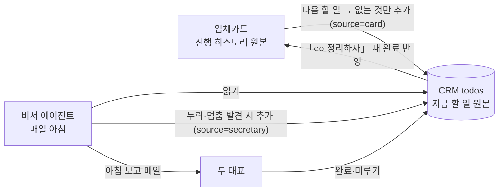

# TODO_DESIGN — SGCRM 할 일(ToDo) 체계화 설계안

> 작성 2026-10-06 · 정석진 대표 요청 · **A~D단계 구현 완료(2026-10-06, 권장안대로)** — E단계(비서)는 별도
> 관련: `WORK_STRUCTURE.md`(§1 놓치는 일, §5 비서 에이전트), `SPLIT_PLAN.md`(뷰어화), `COMPANY_MASTER.md`(기업 키)
> 사장님 결정 반영: **기업 연결 없이도 손으로 바로 입력** · **담당자 구분 없이 공동** · 진행 순서 기업등록 → **ToDo** → 캘린더

---

## 1. 목적

ToDo를 **두 대표와 비서 에이전트가 함께 쓰는 「할 일 저장소」** 하나로 만든다.
화면은 할 일을 아래 네 칸으로 나눠 보여 준다. `WORK_STRUCTURE.md` §1의 "놓치는 일 5가지"를 이 화면에서 잡는 것이 목표다.

| 칸 | 질문 | 대표 예 |
|---|---|---|
| 🔴 **놓치고 있는 일** | 지금 안 보면 손해 보는 것은? | 마감 지남, 2주째 멈춘 일, 잠재고객 연락 끊김 |
| 🟡 **지금 하는 일** | 손대고 있는 것은? | 청림테크 중진공 신청서 작성 중 |
| 🔵 **해야 할 일** | 30일 안에 해야 하는 것은? | 하이퍼다인 벤처인증 서류 요청 (10/20) |
| ⚪ **앞으로 할 일** | 그 뒤에 올 것은? | 드림솔라 벤처 갱신(11/14), 연구소 연간신고(4월) |

---

## 2. 지금 상태 (2026-10-06 실데이터)

- 저장 위치 `todos` · **9건** · 칸 = 상태 3개(대기·진행·완료) · 필드 `text` `status` `tag` `dueDate`
- 자동 생성 2종: 인증 갱신 D-90(`certTaskId`, 태그 「인증」), ISO 차기심사(`isoAuditId`, 태그 「ISO」) — **페이지를 열 때마다** 돈다
- 마감이 있으면 구글 캘린더로 전송(`gcalSyncTodo`), 완료하면 캘린더에서 지움

| 문제 | 실제 예 |
|---|---|
| 기업이 **글자로만** 들어가 있음 → 기업별로 모아 볼 수 없음 | "김종지 대표 월요일 31일 연락하기", "JR컴퍼니 노무사 소개" |
| **어디서 생긴 일인지** 알 수 없음 (손 입력 / 자동 / 업체카드) | 태그를 출처처럼 쓰는 중(「인증」「ISO」「미팅」「긴급」) |
| **놓친 일을 계산하지 않음** — 마감 색만 바뀜 | 8/31 연락 건이 `대기`로 한 달 넘게 남아 있음 |
| 멈춘 일을 알 수 없음 (`updatedAt` 없음) | "하이퍼다인 벤처인증" 진행 중 — 언제부터인지 모름 |
| 업체카드 「다음 할 일」과 따로 놂 | 청림테크 카드에 할 일 9개, CRM엔 0개 |
| 잠재고객 후속이 들어갈 자리 없음 | 기업 그룹 「잠재고객」은 있으나 할 일과 연결 안 됨 |

---

## 3. 네 칸 — 저장하는 값이 아니라 **계산해서 나누는 보기**

상태는 지금처럼 `대기 / 진행 / 완료` 세 가지만 저장한다. 칸은 아래 규칙으로 **위에서부터 먼저 걸리는 곳**에 넣는다(한 할 일은 한 칸에만).

| 순서 | 칸 | 규칙 | 표시하는 이유 배지 |
|---|---|---|---|
| 1 | 🔴 놓치고 있는 일 | 완료 아님 **그리고** 다음 중 하나 | |
| | | ① 마감일 지남 | `마감 3일 지남` |
| | | ② `진행`인데 **14일** 넘게 고친 적 없음 | `16일째 그대로` |
| | | ③ `대기`인데 마감 **3일** 이내 | `D-2 · 아직 시작 안 함` |
| | | ④ 잠재고객 후속 기한 지남 (§6) | `견적 후 21일 무응답` |
| 2 | 🟡 지금 하는 일 | 상태 `진행` | 마감 있으면 `D-n` |
| 3 | 🔵 해야 할 일 | 상태 `대기` + (마감 없음 **또는** 마감 30일 이내) | `D-n` |
| 4 | ⚪ 앞으로 할 일 | 상태 `대기` + 마감 30일 넘게 남음 | 날짜 |
| — | ✅ 완료 | 상태 `완료` — 기본은 접어 두고 최근 7일만 | |

> 기준 숫자(14일·3일·30일)는 한 곳(설정)에 두고 화면에서 바꿀 수 있게 한다.

---

## 4. 데이터 — `todos` 확장 (기존 9건은 그대로 읽힘)

| 필드 | 뜻 | 필수 | 비고 |
|---|---|---|---|
| `text` | 할 일 | ✅ | 기존 |
| `status` | `wait` / `ing` / `done` | ✅ | 기존 |
| `dueDate` | 마감 `YYYY-MM-DD` | | 기존. 있으면 캘린더 전송 |
| `bizno` | **연결 기업** (사업자번호·임시번호) | | 🆕 비우면 기업 없는 할 일 |
| `companyName` | 기업명 사본 | | 🆕 기업이 지워져도 읽히게 |
| `category` | 업무 분야 (CRM 대분류 key) | | 🆕 정책자금·지원사업·벤처·ISO·연구소·특허·확인서… |
| `source` | 생긴 곳 | ✅ | 🆕 `manual` 손 입력 · `cert` 인증 갱신 · `iso` ISO · `annual` 연간신고 · `lead` 잠재고객 · `card` 업체카드 · `secretary` 비서 |
| `sourceRef` | 출처의 ID | | 🆕 중복 생성 방지 (기존 `certTaskId`·`isoAuditId`는 그대로 인정) |
| `priority` | `high` / 보통 | | 🆕 기존 태그 「긴급」 대체 |
| `tag` | 자유 태그 | | 기존 유지 (미팅 등) |
| `memo` | 진행 메모 (짧게) | | 🆕 |
| `createdBy` | `정석진` / `김학미` / `비서` | | 🆕 담당 구분 아님 — **누가 적었는지** 기록만 |
| `createdAt` `updatedAt` `doneAt` | 시각 | | 🆕 `updatedAt` = 멈춘 일 판정 기준 |

- **담당자 필드는 두지 않는다**(사장님 결정: 공동).
- 기존 9건: 글자 속 기업명을 기업 목록과 맞춰 **연결 후보를 제안** → 사장님 확인 후 저장. 출처는 `certTaskId`→`cert`, `isoAuditId`→`iso`, 나머지 `manual`.

---

## 5. 화면

```
┌ 할 일 ─────────────────────────────────────────────────────────────┐
│ [+ 빠른 입력: "하이퍼다인 서류 독촉 10/10"  ▸ 기업 자동 인식]          │
│ 필터: [기업 ▾] [분야 ▾] [생긴 곳 ▾]   기준: 멈춤 14일 · 앞으로 30일     │
├──────────────┬──────────────┬──────────────┬──────────────────────┤
│ 🔴 놓치는 일 3 │ 🟡 지금 하는 일 4 │ 🔵 해야 할 일 6 │ ⚪ 앞으로 할 일 12     │
│ ┌──────────┐ │              │              │                      │
│ │김종지 대표 연락│ │              │              │                      │
│ │마감 36일 지남  │ │              │              │                      │
│ │[완료][미루기]  │ │              │              │                      │
└──────────────┴──────────────┴──────────────┴──────────────────────┘
```

- **빠른 입력 한 줄**: 글을 치면 기업명·날짜를 알아서 찾아 **제안만** 함(확인 후 저장). 기업 없이도 저장 가능.
- 카드: 기업 칩(누르면 기업 창, 📂 드라이브 폴더) · 분야 · 이유 배지 · 버튼 `시작` `완료` `미루기(+7일/날짜)`.
- **기업 창 안에 「이 기업의 할 일」** 목록 + 바로 추가.
- 대시보드 첫 화면에 **네 칸 숫자**(놓친 일은 빨간색).
- 지금의 「클릭하면 상태가 돌아가는」 방식은 실수로 바뀌기 쉬워 **버튼 방식**으로 바꾼다.

---

## 6. 자동으로 생기는 할 일

| 출처 | 언제 | 할 일 | 상태 |
|---|---|---|---|
| `cert` 인증 갱신 | 만료 90일 전 | "[기업] ○○ 갱신 준비", 마감 = 만료일 | ✅ 있음 |
| `iso` ISO 차기심사 | iso-one 차기 마감 기준 | "[기업] ISO 사후/갱신심사 준비" | ✅ 있음 |
| `annual` 연구소 연간신고 | 매년 **3월 1일** | "[기업] 연구소 연간신고", 마감 4/30 | 🆕 |
| `lead` 잠재고객 후속 | 기업 그룹 「잠재고객」 + 마지막 연락 후 **N일** | "[기업] 후속 연락" | 🆕 |
| `card` 업체카드 | 카드 「다음 할 일」 중 CRM에 없는 것 | 카드 문구 그대로 | 🆕 비서 |
| `secretary` 비서 | 새 자료 점검에서 누락 발견 | "[기업] ○○ 서류 누락 — 요청" | 🆕 비서 |

- 같은 출처·같은 ID로는 **두 번 만들지 않는다**(`source`+`sourceRef`).
- 지금은 자동 생성이 **페이지를 열 때마다** 돈다(PC·노트북·폰 동시 실행). → 비서 에이전트가 생기면 **비서가 하루 한 번** 만들도록 옮긴다(`SPLIT_PLAN.md` §4와 같은 방향).
- 잠재고객 「마지막 연락」은 처음에는 **그 기업의 마지막 완료 할 일 날짜**로 본다(새 칸 없이 시작). 부족하면 기업에 `lastContactAt`을 둔다.

---

## 7. 비서 에이전트·업체카드와의 관계



- **할 일의 원본 = CRM `todos`**, **업체 히스토리의 원본 = 업체카드**. 카드 → CRM은 **없는 것만 추가**(한 방향)로 시작한다. 양방향 자동 동기화는 꼬이기 쉬워 하지 않는다.
- 비서의 아침 메일 4항목(새 자료·기한 임박·멈춘 업체·잠재고객)은 §3 「놓치고 있는 일」 계산을 그대로 쓴다.
- ⚠️ **비서가 CRM에 쓰는 길이 필요하다.** 이 작업 환경에서 Claude의 Firestore 직접 쓰기는 권한에서 막혀 있다(2026-10-06 확인). 방법을 하나 정해야 한다:
  ① 사장님 승인 하에 쓰기 허용 ② 비서는 **읽고 메일만**, 추가는 사람이 클릭 한 번으로(제안 목록) ③ 별도 서버 함수.
  → **②로 시작 권장**(안전, 지금 바로 가능).

---

## 8. 구글 캘린더

- 지금처럼 **마감 있는 할 일만** 보낸다. 완료하면 지운다.
- 3단계(두 대표 공용 업무 캘린더)에서 보내는 곳만 공용 캘린더로 바꾼다.
- 놓친 일·앞으로 할 일 구분은 캘린더에 보내지 않는다(CRM 화면 전용).

---

## 9. 하지 않는 것 (이번 범위 밖)

- 담당자 지정·배분 (공동 결정)
- 하위 작업(체크리스트 안의 체크리스트)
- 일반 반복 일정(매주 ○요일) — 규칙으로 생기는 것(§6)만
- 앱 푸시 알림 — 알림은 비서 메일과 구글 캘린더로

---

## 10. 만드는 순서 (각 단계 끝에 사장님 확인)

| 단계 | 내용 | 코드 | 데이터 |
|---|---|---|---|
| A | 필드 확장 + 입력창(기업·분야·마감·메모, 빠른 입력) | 중 | 기존 9건 그대로 |
| B | 네 칸 보기 + 놓친 일 계산 + 이유 배지 + 버튼 | 중 | 없음 |
| C | 기업 창 「이 기업의 할 일」, 대시보드 숫자 | 소 | 없음 |
| D | 기존 9건 기업 연결(제안→확인), 연간신고·잠재고객 자동 생성 | 중 | 9건 갱신 |
| E | 비서 에이전트 연동(②: 아침 메일 + 제안 목록) | 별도 | 없음 |

---

## 11. 정해 주실 것

- [x] 기준 숫자: 멈춤 **14일** / 대기인데 임박 **3일** / 해야·앞으로 경계 **30일** — 이대로?
- [x] 잠재고객 후속 주기: **14일** (화면에서 변경 가능)
- [x] 업무 분야 목록: 기존 대분류 + **확인서·재무 신설**(`WORK_STRUCTURE.md` §3) 반영?
- [x] 「보류」 상태: **두지 않음** (미루기로 대신)
- [x] 비서의 CRM 쓰기 방식: ① 허용 / **② 제안 목록(권장)** / ③ 서버 함수
- [x] 업체카드 「다음 할 일」 가져오기: 카드 있는 업체부터 (기업 창 📇 버튼)
