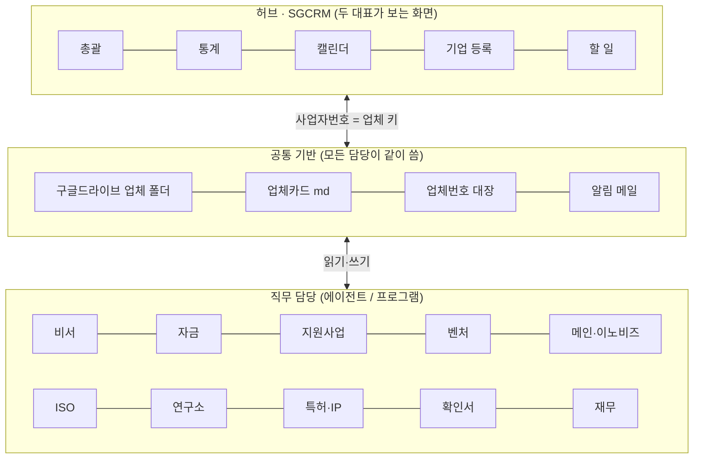
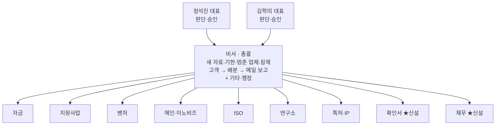
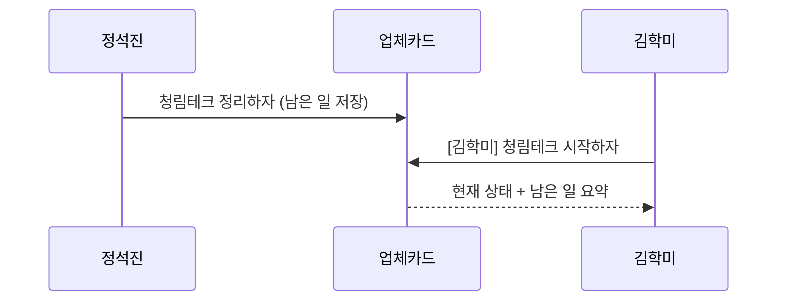
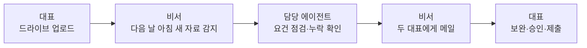
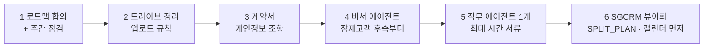
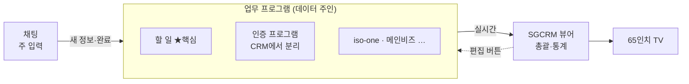

# WORK_STRUCTURE — SG솔루션 업무 구조 · 에이전트 설계

> 작성 2026-10-06 · 정석진 대표 ↔ Claude 대화 정리본 · 공동대표 논의 전 초안
> 관련 문서: `SPLIT_PLAN.md`(9/27, 데이터 주인별 분리 계획), `PROGRESS.md`, `CLAUDE.md`
> 이 문서는 **방향 합의용**입니다. 합의 전에는 이 문서만 보고 코드를 고치지 않습니다.

---

## 1. 출발점 — 놓치고 있는 일

| # | 놓치는 일 | 예 | 영향 |
|---|---|---|---|
| 1 | 과거 일정의 후속 업무 | 사후심사, 재신청 시점, 인증 만료, 연구소 연간신고(4월) | 기한 경과 |
| 2 | 신규 업체 들어왔을 때 할 일 | 서류 요청, 진단, 업무 순서 | 착수 지연 |
| 3 | 업체별 남은 일 | 여러 채팅·두 대표에게 흩어짐 | 다시 묻고 다시 확인 |
| 4 | **잠재고객 후속 연락** | 상담·견적 후 연락 끊김 | **계약 손실(매출 직결)** |
| 5 | 반복 서류 확인·작성 | 같은 서류 매번 읽기, 비슷한 신청서 매번 작성 | 업무시간 잠식 |

방향: 직원 채용 대신 **비서 1 + 직무 담당 에이전트**, SGCRM은 **총괄·통계 화면**으로 단순화.

---

## 2. 목표 구조 — 세 층



- 업체 키는 **사업자번호**(CRM 기존 키). 업체번호(001…)는 사업자번호 없는 예비창업자용 **보조 번호**로만 사용.
- 직무마다 프로그램을 새로 만들지 않음. 공통 기반 하나를 모든 담당이 같이 씀.

---

## 3. 가상 조직도 — CRM 대분류 매핑



| 담당 | SGCRM 대분류(key) | 주요 업무 | 형태 |
|---|---|---|---|
| 비서 | etc 기타·행정 | 매일 점검·배분·보고, 잠재고객 후속 | 에이전트 (Claude 예약 작업) |
| 자금 | policy 정책자금 · fund 일반자금조달 | 중진공, 소진공, 기보·신보, 재단, 특례보증 | 에이전트 |
| 지원사업 | support 지원사업 | 공고 매칭, 예비·초기창업패키지 사업계획서(PSST), 집행·정산 | 프로그램(매칭: sg-crm-support-matcher) + 에이전트 |
| 벤처 | ven 벤처·이노비즈 | 벤처확인 신청, 이의신청 | 에이전트 |
| 메인·이노비즈 | ven 벤처·이노비즈 | 자가진단 점수, 증빙, 3년 갱신 | 프로그램(메인비즈 자동화) + 에이전트 |
| ISO | iso ISO 인증 | 심사 문서, 조직도·공정도, 사후·갱신 | 프로그램(iso-one) + 에이전트 |
| 연구소 | lab 기업부설연구소 | 설립·전담부서, 매년 4월 연간신고 | 에이전트 |
| 특허·IP | pat 특허·지재 | 출원 일정, 가출원 정규전환(12개월), IP 지원사업 | 에이전트 |
| **확인서** | **없음 → 신설 검토** | 공장등록, 뿌리기업, 소부장, 직접생산, 여성·장애인기업 | 에이전트 |
| **재무** | **없음 → 신설 검토** | 재무제표 분석, 부채비율, 가결산 | 에이전트 |

> TODO(코드): Firestore에 화면에서 추가한 사용자 대분류가 있는지 확인. 없으면 `DEFAULT_CAT_META`에 확인서·재무 추가 여부 결정. `cert_master`의 `direct_prod`, 여성기업 등은 확인서로 묶을지 검토.

**프로그램 vs 에이전트 기준**

| | 프로그램 | 에이전트 |
|---|---|---|
| 맞는 일 | 양식 고정, 점수·계산, 여러 업체 일괄 | 서류 읽기, 요건 판단, 초안 작성, 누락 찾기 |
| 예 | 메인비즈 점수, iso-one 문서, 공고 매칭 | 중진공 신청 검토, 사업계획서 초안, 확인서 요건 점검 |
| 유지보수 | 코드 수정 필요 (부담 큼) | 매뉴얼(스킬) 문서만 수정 |

---

## 4. 업체카드 체계 (운영 중 · sg-client-card 스킬)

```
관리 업체 List/
├ 업체번호_대장.md            ← 번호·업체명·지역·폴더 ID (title로 검색, file id 고정 금지)
└ <시도>/<지역>_<업체명>_<대표>/
   ├ 1.기본공통서류/ 상담/ 계약서/ …
   └ 업체카드/
      ├ 001_업체카드_청림테크.md                ← 현재 카드 (날짜 꼬리 없음)
      ├ 001_업체카드_청림테크_261003-1857.md    ← 이력 (최근 5개만)
      └ …
```

| 명령 | 동작 |
|---|---|
| `[이름] ○○ 시작하자` | 대장 → 현재 카드 + 마지막 정리 이후 새 파일만 읽고 요약 |
| `○○ 정리하자` | 현재 카드를 `_<YYMMDD-HHMM>`로 이름 변경(이력) → 새 현재 카드 생성 → 이력 5개 초과분 정리 |
| `신규업체 ○○ 시작하자` | 다음 번호 부여, 업체카드·1.기본공통서류·상담·계약서 폴더 생성, 대장 등록 |



등록 현황: 001 ㈜청림테크(경기 용인), 002 ㈜하이퍼다인(경북 경산). 나머지 97곳은 카드 없음.

**CRM과의 관계 (미결)**: 히스토리가 SGCRM · 업체카드 · Claude 메모리 세 곳에 나뉨 → 어디를 원본으로 할지 정해야 함.
후보안: 업체 진행 히스토리 원본 = 업체카드, CRM은 상태·기한·할 일 요약만 보유(카드 링크).

---

## 5. 비서 에이전트 흐름



아침 보고 메일 형식:
```
[SG 오늘의 업무] 10월 7일 (수)
- 새 자료   · 업체: 접수 서류, 누락 서류, 확인 필요 요건
- 기한 임박 · 업체: 마감일, 확인 안 된 항목
- 멈춘 업체 · 업체: 마지막 진행 후 N주 경과
- 잠재고객 · 업체: 견적 발송 후 무응답
```

실행 방식: Claude 예약 작업(클라우드, PC 불필요, Drive·Gmail·Calendar 연결 사용).
SGCRM과 연결 시: `SPLIT_PLAN.md`의 **캘린더 에이전트**(첫 분리 추천)와 기한 데이터를 공유.

---

## 6. 검토 의견 — 꼭 짚을 점

| # | 우려 | 이유 | 제안 |
|---|---|---|---|
| 1 | 놓침은 도구보다 습관 문제일 수 있음 | 수시 대화는 급한 일 위주 → 멈춘 업체·잠재고객 누락 | 주 1회 30분 고정 점검, 비서 메일을 자료로 |
| 2 | “만들면 된다” 함정 | SGCRM, iso-one, 메인비즈 자동화, 매칭, 카드, 에이전트 9개, SaaS → 유지보수 누적 | 한 번에 하나, 시간 측정 후 큰 것부터 |
| 3 | 매출 손실은 잠재고객에서 | 계약 전 업체는 폴더·카드 없음 | 비서 첫 업무 = 잠재고객 후속 |
| 4 | 고객 자료 지연은 AI가 못 품 | 서류가 안 오면 에이전트도 멈춤 | 자료 요청·독촉 인력(파트타임) 검토 |
| 5 | 데이터 정리 선행 | 중복·오분류 폴더, 채팅에만 있는 자료 | 폴더 정리 + 업로드 규칙 |
| 6 | 개인정보 | 신분증, 4대보험 명부, 통장사본 | 민감 서류 분리, 계약서 AI 처리 동의 조항 |
| 7 | 대리작성 금지 | 중진공 제3자 개입, 창업패키지 대리작성 | 초안·코칭은 우리, 확정·제출은 대표자 |
| 8 | 두 대표 로드맵 불일치 | SGCRM 직접 수정 vs 분리·에이전트 구상 → 같은 코드를 다른 방향으로 | `SPLIT_PLAN.md` 기준 한 방향 합의 |
| 9 | 내부 도구 / SaaS 혼재 | 둘 다 늦어짐 | 내부용 먼저, 판매는 검증 후 분리 |

같은 Claude 계정 공유: ① 사용자 식별 불가 → `[이름]` 접두어 ② 메모리 혼합 → 업체 정보는 카드에만 ③ 요금제 약관 → 팀 요금제 검토.

---

## 7. 추진 순서 (수정안)



| 단계 | 내용 | 주체 | 코드 영향 |
|---|---|---|---|
| 1 | 로드맵 합의, 주간 점검 시간 | 두 대표 | 없음 |
| 2 | 드라이브 정리, 업로드 규칙, 민감정보 분리 | 대표 + Claude | 없음 (드라이브 폴더 연결 기능과 규칙 맞춤) |
| 3 | 계약서 개인정보·AI 조항 | 두 대표 | 없음 |
| 4 | 비서 에이전트 | Claude | CRM 읽기 전용 연동(선택) |
| 5 | 반복 서류 1개 직무 에이전트 | Claude | 없음 |
| 6 | SGCRM 총괄·통계 뷰어화 | 김학미 대표 중심 | **큼** — `SPLIT_PLAN.md` 따름 |

---

## 8. 결정 사항 (2026-10-07, 정석진 대표)

**원칙: 입력은 채팅과 업무 프로그램에서만. SGCRM은 화면을 유지하되 직접 입력을 모두 없앤다(뷰어).**



| 항목 | 결정 |
|---|---|
| 할 일 상태 | 해야 할 일 / 하는 중 / **기다리는 중** / 완료. **놓친 일은 자동 계산**(기한 경과 + 미완료) |
| 필수 항목 | 업체(사업자번호) · 기한. 미입력 시 기한=다음 영업일. **담당은 선택**(10/7 수정: 비우면 "공통") |
| 추가 항목 | 업무(대분류) · 종류(전화·서류·신청·방문·독촉·내부) · 출처 · 작성자 · 메모 · 완료일 |
| 할 일 vs 기록 | 앞으로 할 일만 할 일 목록. 이미 있었던 일은 업체카드 히스토리 |
| 저장소 | **기존 SGCRM `todos` 그대로** (10/6 `TODO_DESIGN.md` A~D 구현분). 새 저장소 만들지 않음 |
| 채팅 → 할 일 | **1단계(지금)**: 채팅이 sgceo 캘린더에 「할일 …」 일정 생성 → 드라이브 스크립트 v5가 10분 안에 `todos`로 이동(추가만 가능). **2단계**: Firestore 전용 연결 도구(MCP)로 완료·수정·조회까지 |
| 시험 | ~~노션 1주 시험~~ → **취소(10/7). 독립 할 일 웹 화면을 바로 만들어 적용** |
| 할 일 화면 | 두 대표가 하루 대부분 보는 **메인 업무 화면**. 인증·갱신 등은 결과와 자동 생성된 할 일로만 표시 |
| SGCRM 할 일 | 독립 할 일 프로그램으로 대체. CRM에는 보기만 남김 |
| 분리 순서 | **할 일 → 인증**. 인증은 연결이 가장 많아(SPLIT_PLAN 기준) 할 일 분리 후 진행. `createCertTasks`·`createIsoTasks`의 할 일 자동 생성은 새 할 일 프로그램으로 이전 |
| 캘린더 | 약속(미팅·실사·방문)만. 할 일 전체를 캘린더로 동기화하지 않음 |

현재 SGCRM `todos` 필드: `text, status(wait/ing/done), tag, dueDate, createdAt` → 업체·담당·시각·종류·출처가 없음. 이전 시 필드 매핑 필요.

---

## 9. 김학미 대표와 확인·결정할 것

> 10/7 업데이트: A 전부 동의 완료. B는 제안대로 운영해 보며 결정(요금제는 현행 Max 유지). C는 노션 시험 없이 바로 적용.

### A. 정석진 대표안 확인 (동의 완료 ✅)
- [ ] 8장 원칙 전체: 채팅·업무 프로그램에서만 입력, SGCRM은 뷰어(입력 제거)
- [ ] 분리 순서 할 일 → 인증 (김학미 대표의 SGCRM 수정 작업과 충돌 여부)
- [ ] 히스토리 위치: 진행 기록 = 업체카드, 할 일 = 할 일 목록, Claude 메모리에는 업체 정보 안 둠
- [ ] 잠재고객: 할 일 목록 업무 "영업·잠재고객"으로 관리
- [ ] 대분류 신설 확인서·재무 (할 일 목록엔 이미 반영, SGCRM 반영 여부)

### B. 새로 정해야 할 것
- [ ] 주간 점검 요일·시각 (30분)
- [ ] 반복 서류 작업 Top 3 + 소요 시간 → 첫 직무 에이전트 대상
- [ ] 비서 설정: 김학미 대표 메일, 보고 시각, 범위(카드 있는 업체만 / 99곳 전체)
- [ ] Claude 요금제 (계정 공유 유지 / 팀)
- [ ] 개인정보·계약서 AI 처리 조항
- [ ] 자료 독촉 인력(파트타임) 필요 여부

### C. 1주 시험 후 (10/14)
- [ ] 노션 할 일 시험 결과 → 항목 확정, Firestore 할 일 프로그램 개발 착수
